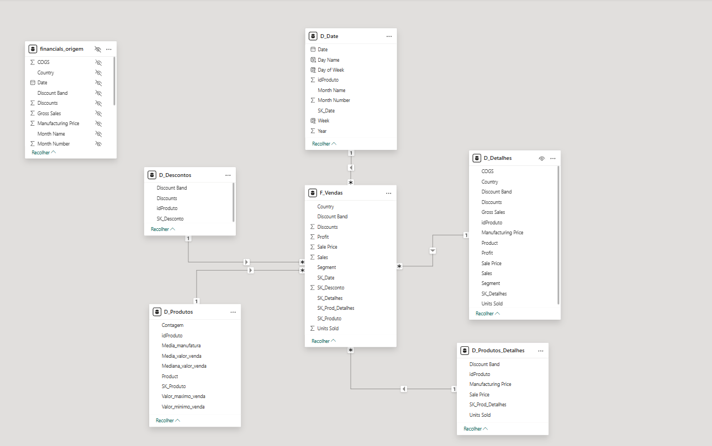

# Projeto: Modelagem Dimensional (Star Schema) com Financial Sample

Este repositório contém a resolução do desafio de projeto de **Modelagem de Dados no Power BI**. O objetivo foi transformar uma base de dados transacional única (flat table) em um modelo dimensional (Esquema Estrela), otimizado para análise de dados.

A base utilizada foi a **Financial Sample** da Microsoft.

## 📊 O Modelo Dimensional

O modelo foi construído separando os dados em tabelas Fato e Dimensão, garantindo integridade e facilitando a performance das consultas DAX.

### Estrutura das Tabelas

1.  **`F_Vendas` (Tabela Fato):**
    * Tabela central que armazena as métricas de vendas e as chaves estrangeiras (SK) para conexão com as dimensões.
    * **Métricas:** `Sales`, `Profit`, `Units Sold`, `Discounts`.
    * **Chaves:** `SK_Produto`, `SK_Detalhes`, `SK_Date`, etc.

2.  **`D_Produtos` e `D_Produtos_Detalhes`:**
    * Contém as informações descritivas dos produtos, estatísticas de valores de venda (Média, Mediana, Máximo, Mínimo) e faixas de desconto.

3.  **`D_Date` (Calendário):**
    * Dimensão de tempo criada para permitir análises temporais detalhadas (Ano, Mês, Dia da Semana).

4.  **`D_Detalhes` e `D_Descontos`:**
    * Tabelas auxiliares contendo informações segmentadas sobre descontos e detalhes operacionais das vendas.

5.  **`financials_origem`:**
    * Tabela original mantida oculta para fins de backup e auditoria.

---

## 🛠️ Processo de Construção (Etapas)

O desenvolvimento seguiu as seguintes etapas de transformação no **Power Query** e modelagem no **Power BI Desktop**:

1.  **Extração e Backup:** Importação da tabela `financials` original e criação de uma duplicata oculta (`financials_origem`) para segurança.
2.  **Definição do Modelo:** Análise das colunas para separar o que era atributo descritivo (Dimensão) do que era valor numérico agregável (Fato).
3.  **Criação das Dimensões:**
    * Utilização da funcionalidade "Duplicar Tabela" e "Agrupar Por" no Power Query para criar valores únicos para os produtos e categorias.
    * Criação de Índices Condicionais para gerar as Chaves Primárias (SK - Surrogate Keys).
4.  **Limpeza da Tabela Fato:**
    * Remoção das colunas descritivas (texto) que foram migradas para as dimensões, mantendo apenas as chaves (IDs) e as métricas.
5.  **Criação da Tabela de Data:**
    * Criação da `D_Date` aproveitando os dados temporais já existentes na base e refinando com DAX.

---

## 📈 Funcionalidades e Funções DAX

Diferente da abordagem padrão de criar uma tabela calendário do zero com `CALENDARAUTO()`, optei por aproveitar a estrutura de datas já existente na base de dados para otimizar o modelo, complementando com colunas calculadas via DAX para extrair informações específicas.

**Principais funções DAX utilizadas:**

* **`WEEKNUM`**: Utilizada para extrair o número da semana do ano, permitindo análises de sazonalidade semanal.
* **`FORMAT`**: Utilizada para formatar as datas e obter nomes de dias e meses de forma textual (ex: "Janeiro", "Segunda-feira") para melhor visualização nos gráficos.
* **Agregações (Soma, Média):** Funções implícitas e explícitas para cálculo de totais na tabela fato.

## 🚀 Conclusão

O projeto demonstra a capacidade de transformar dados desestruturados em um modelo de BI coerente, facilitando a criação de dashboards performáticos e organizados.
